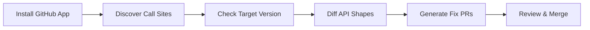

<div align="center">


# DriftLock

**Self-maintaining APIs.**

API providers shouldn't just announce changes, they should apply them.

When Stripe ships a breaking change or a new feature, DriftLock scans your codebase, identifies affected usages, and opens a PR with the fix.

[Website](https://driftlock.dev) · [Discord](https://discord.gg/driftlock) · [Issues](https://github.com/nerdev-co/DriftLock/issues)

[](https://www.npmjs.com/package/@driftlock/cli)
[](https://github.com/nerdev-co/DriftLock/stargazers)
[](https://github.com/nerdev-co/DriftLock/actions)
[](./LICENSE)
[](https://coderabbit.ai)

</div>

---

## Why DriftLock

API communication is broken. Breaking changes ship with little warning. Useful features quietly launch and go unnoticed. Changelogs don't get read.

The cost always lands on you(the consumer), not the vendor who made the change.

DriftLock makes APIs self-maintaining. When a vendor changes something, your codebase updates automatically. You review the PR and merge. No manual scanning. No migration guides. No 2am pages.

---

## How it works



| Step         | What happens                                             |
| ------------ | -------------------------------------------------------- |
| **Discover** | Static analysis finds every API call in your codebase    |
| **Classify** | Identifies which tests hit real sandbox vs. mocked       |
| **Probe**    | Runs your tests, captures actual request/response shapes |
| **Diff**     | Compares current shapes against target version           |
| **Fix**      | Opens PRs with the diffs and suggested fixes             |
| **Report**   | Shows which call sites are monitored, blind, or untested |

The goal: when Stripe ships a change, your codebase updates automatically. You just review and merge.

---

## Quick start

```bash
# Install
bun add -g @driftlock/cli

# Analyze your codebase
driftlock analyze ./src

# Run in sandbox
driftlock test ./repo

# Generate fixes
driftlock fix ./repo
```

[Full documentation →](./docs/architecture.md)

---

## What you're used to vs. what DriftLock does

| Today                                  | With DriftLock                         |
| -------------------------------------- | -------------------------------------- |
| Avoid upgrades because they're tedious | Automated codebase scanning            |
| Manually find affected call sites      | All affected calls found automatically |
| Copy-paste migration guide changes     | Fix diffs generated and ready to merge |
| Weeks to upgrade, so you don't         | Minutes to review a PR                 |
| Stuck on old versions                  | Stay current with minimal effort       |

---

## Why not Renovate / Dependabot?

They update the version number in `package.json`. They don't change your code.

When `stripe.charges.create({ amount: 100 })` needs to become `stripe.charges.create({ value: 100 })`, Renovate doesn't touch that. DriftLock does.

| Renovate              | DriftLock                   |
| --------------------- | --------------------------- |
| Bumps version         | Updates your code           |
| Handles `npm install` | Handles call site migration |
| Dependency management | Code migration              |

---

## Why not just semver?

Semver is a convention, not a guarantee. Many APIs don't follow it strictly. And even when they do, upgrading major versions means manually finding and fixing every affected call site — which is why teams avoid it.

DriftLock works regardless of versioning scheme. It monitors the actual API surface, not the version number.

---

## Why not just test coverage?

High test coverage helps — if your tests aren't mocked. Most are. DriftLock classifies which tests actually hit the real API vs. which just mock the response. You can't catch API drift with mocked tests.

---

## First target: Stripe

Stripe has mature test mode, huge installed base, and plenty of teams stuck on old API versions. First vendor — not the only one.

Twilio, Shopify, and others are on the roadmap.

---

## Security

If you discover a security vulnerability, please report it responsibly.

**Email:** security@driftlock.dev

Do NOT open a public GitHub issue for security vulnerabilities.

---

## Contributing

We welcome contributions! See [CONTRIBUTING.md](./CONTRIBUTING.md) for guidelines.

---

## Community

- [Discord](https://discord.gg/driftlock) — Ask questions, share feedback
- [GitHub Discussions](https://github.com/nerdev-co/DriftLock/discussions) — Architecture decisions, design talks
- [Twitter](https://twitter.com/driftlock) — Updates and announcements

---

## License

MIT © [DriftLock](https://github.com/nerdev-co/DriftLock)
